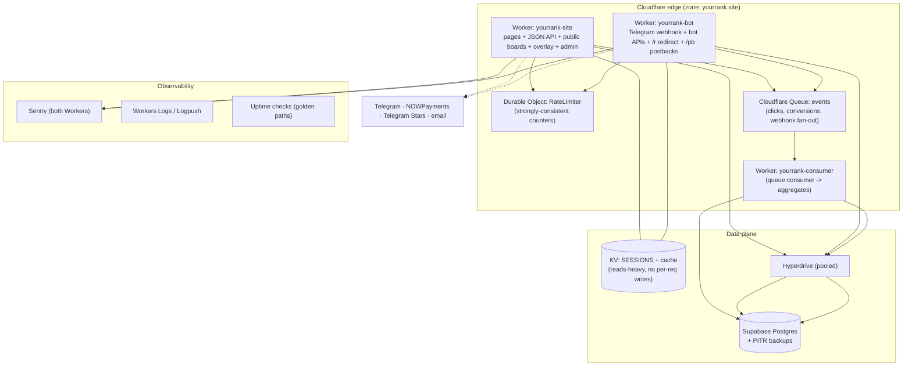
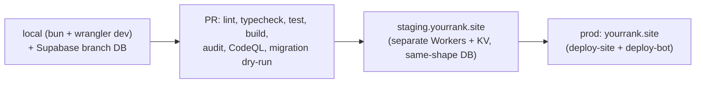

# YourRank — Target Architecture (Launch-Ready Blueprint)

> Status: **proposed / target**. This is the architecture I'd take the platform to
> before a serious launch so it stays up, scales, and doesn't drag the team back into
> firefighting. It builds on today's design (see [`architecture.md`](./architecture.md)
> for current state and [`bot-architecture.md`](./bot-architecture.md) for the bot),
> keeps what already works, and fixes the structural traps that caused the outages.
>
> Each change lists **why** (the trap it removes). Ordered by leverage.

---

## 0. Design principles (the rules that prevent debugging traps)

1. **Fail open on infrastructure, fail closed on security.** A cache/limiter hiccup
   must never take the platform down; an auth/permission check must never silently pass.
2. **Never do unbounded per-request writes to a quota'd store.** (This single rule
   would have prevented the KV outage.)
3. **The hot path never blocks on best-effort work.** Logging, analytics, webhooks →
   async/queue, never inline.
4. **Every entry point returns a Response.** No unhandled throw ever reaches Cloudflare
   (which turns it into a 1101). One guaranteed `try/catch` per Worker entry.
5. **One identity, one dashboard.** No parallel auth systems.
6. **If it isn't monitored, it's already broken.** Alert before the user notices.
7. **Everything reproducible from git + a blueprint.** No hand-clicked prod state.

---

## 1. Target topology



---

## 2. The structural fixes (highest leverage first)

### 2.1 Rate limiting → Durable Objects (kills the outage class)
**Why:** today the limiter writes a counter to KV **on every request**. KV free tier is
~1,000 writes/day, so the quota burns out mid-day and — because it *was* fail-closed —
429'd the entire platform. Even fail-open (shipped in PR #32) means rate limiting is
effectively **off** once the quota is gone.

**Target:** a `RateLimiter` **Durable Object** keyed by bucket (`ip`, `postback_key`,
`user_id`). DOs give atomic, strongly-consistent in-memory counters with no per-request
external write quota, and coordinate correctly across isolates.
- Fallback still fail-open if the DO is unreachable.
- Alternative if you don't want DOs: Cloudflare's native **Rate Limiting binding**.
- KV goes back to what it's good at: sessions + cached reads (write-rarely).

### 2.2 Async event pipeline for clicks/conversions → Cloudflare Queues
**Why:** `/r/:slug` and `/pb` write to Postgres on the hot path (mitigated today with
`waitUntil`, but still coupled to DB availability and latency, and lossy if the isolate
dies). At stream-spike traffic this is the next bottleneck.

**Target:** the edge Worker validates + enqueues an event to a **Queue** and returns
immediately (redirect / 200). A **consumer Worker** batches inserts and updates rollups.
Benefits: absorbs spikes, retries on failure, keeps the redirect sub-10ms, and decouples
tracking from reporting.

### 2.3 One identity, one dashboard
**Why:** two auth systems (email+password on the site, Telegram-only on the bot dash)
confuse users ("I can't add my bot") and double the surface to secure.

**Target:** a single account with **linked identities** — email/password (or magic link)
+ an optional linked Telegram account. Bot connect/customize, boards, billing, analytics
all live in one dashboard. `/bot/dashboard` becomes a section, not a separate app with
its own login.

### 2.4 Guaranteed-Response entry points (kills 1101s)
**Why:** an uncaught throw in a Worker's `fetch` becomes a Cloudflare **1101** page,
which is opaque and un-styleable.

**Target (partly shipped in PR #32):** every Worker `fetch`/`queue`/`scheduled` handler
wrapped in one top-level `try/catch` → structured 500 + Sentry capture. Enforce with a
tiny shared `withWorker()` wrapper so new entry points can't forget it.

### 2.5 Observability before features
**Why:** the 1101s and the 429 outage were invisible until a user reported them.

**Target:**
- **Sentry** on both Workers (bot already has Toucan; add to site).
- **Logpush / Workers Logs** to a store you can query.
- **Uptime/synthetic checks** on the golden paths every minute: `POST /api/auth/login`,
  bot connect, `GET /r/:slug`, `POST /pb`, public board render. Page on failure.
- A **status dashboard** (even a simple one) so support isn't guesswork.

---

## 3. Data & consistency

- **Postgres stays the source of truth.** Enable **PITR / automated backups** (Supabase)
  and test a restore before launch — untested backups aren't backups.
- **Migrations are forward-only and CI-gated:** every migration runs against an ephemeral
  DB in CI; no manual prod SQL. Keep the `supabase/migrations` discipline.
- **Row-Level Security** already exists — audit it so a compromised anon key can't read
  another streamer's data. Add a test that asserts cross-tenant isolation.
- **Money is `numeric`, idempotent, and append-only:** payments/conversions keyed by an
  idempotency key (already partly done for NOWPayments tx ref + conversions) so retries
  and replays can't double-count.
- **Caching contract:** L1 (isolate map) + L2 (KV) for public boards, with explicit TTL
  and an invalidation hook on score updates so streamers don't see stale standings.

---

## 4. Security hardening (pre-launch checklist)

- Secrets only via `wrangler secret` / env — **never** in code or wrangler.toml (audit).
- **Encrypt at rest**: bot tokens (done), postback keys (done) — verify key rotation
  (`/api/reencrypt`) is runnable and documented.
- **CSRF** on all state-changing site routes (done); **HMAC-signed** postbacks preferred
  over the legacy URL-key path (already deprecating — set the sunset date and enforce it).
- **Admin**: behind admin flag + TOTP 2FA (done); add an audit log for every admin action
  (table exists — make sure every mutating action writes to it).
- **CSP** with per-request nonce (done); add `report-uri` so violations are visible.
- **Abuse**: per-account login lockout (done) + DO rate limits + Turnstile on signup/login
  to stop bot signups.
- **Dependency + code scanning** in CI: CodeQL + `npm audit`/`osv` (present) — block merges
  on high-severity.

---

## 5. Environments & delivery



- **Staging already exists** in wrangler config — make it a required smoke-test gate:
  deploy to staging, run the golden-path synthetic suite, then promote to prod.
- **Deploy safety:** the bot typecheck once aborted `deploy-bot` (fixed in PR #30) —
  keep deploy jobs independent so one Worker's failure can't block the other, and add a
  **post-deploy smoke test with auto-rollback** (the repo already references smoke tests).
- **Blueprint/IaC:** wrangler config + a Devin environment blueprint so any dev/CI can
  reproduce setup; no snowflake prod.
- **Feature flags** for risky features (new billing, broadcast changes) so launch issues
  are toggled off, not hot-fixed.

---

## 6. Testing strategy (what "won't fall into debugging traps" needs)

| Layer | What | Tooling |
|---|---|---|
| Unit | pure logic: ratelimit, crypto, plan math, command validation | `bun test` (exists) |
| Integration | handlers against an ephemeral Postgres | CI service DB |
| Contract | Telegram webhook payloads, NOWPayments IPN, postback signature | fixture-driven |
| E2E / synthetic | golden paths on staging + prod (login, bot connect, /r, /pb, board) | headless browser + curl |
| Load | `/r/:slug` + `/pb` at stream-spike RPS | k6 |

Rule: **a bug that caused an incident gets a regression test** before the fix merges
(e.g. the fail-open tests added in PR #32).

---

## 7. Product architecture that makes it valuable to streamers

The tech only matters if it drives the streamer's money and audience. Build features
around the two assets that create lock-in:

### 7.1 Attribution engine (the buying reason)
- End-to-end: `click (/r) → deposit (postback /pb) → $ attributed to streamer`, deduped
  and idempotent.
- A dashboard that says **"you drove $X in deposits / N depositors this month"** — the
  artifact a streamer shows their affiliate manager to negotiate higher rev-share.
- Per-offer, per-campaign, per-link breakdowns; export CSV.

### 7.2 Audience retention via the bot (the moat)
- Subscriber list the streamer **owns** (not rented from a platform algorithm).
- Scheduled broadcasts, "code of the day" auto-posts, welcome DM, custom commands
  (shipped in PR #32), segmentation (subscribers who clicked vs deposited).
- Guardrails: per-bot send rate limits + unsubscribe compliance.

### 7.3 On-stream product (free growth loop)
- Premium OBS overlay (FLIP animations, themes, sponsor slots). Every viewer sees the
  brand → organic acquisition. Keep it a paid unlock.

### 7.4 Frictionless onboarding
- One-paste bot connect, auto-generated tracked links per offer, one-click overlay URL.
  Measure activation (signup → bot connected → first tracked click) and cut every step
  that loses users.

### 7.5 Monetization tied to value
- Free = leaderboard. Paid tiers unlock overlay + broadcasts + postbacks + multi-board +
  custom domain. Price against the affiliate revenue unlocked, not per-seat.

---

## 8. Rollout order (so launch is boring, not heroic)

1. **PR #32** (fail-open + 1101 guards) — stop the bleeding. *(done)*
2. **Rate limiting → Durable Objects** — removes the outage root cause.
3. **Sentry on both Workers + golden-path uptime checks** — see problems first.
4. **Staging smoke-test gate + post-deploy rollback** — safe deploys.
5. **Unify identity/dashboard + one-paste onboarding** — activation.
6. **Queues for clicks/conversions** — scale the hot path.
7. **Attribution dashboard** — the reason streamers pay.
8. **Backups/PITR restore drill + RLS cross-tenant test** — sleep at night.

> Steps 1–4 are "don't fall into debugging traps." Steps 5–8 are "make it worth paying
> for." Ship them in that order.
```
