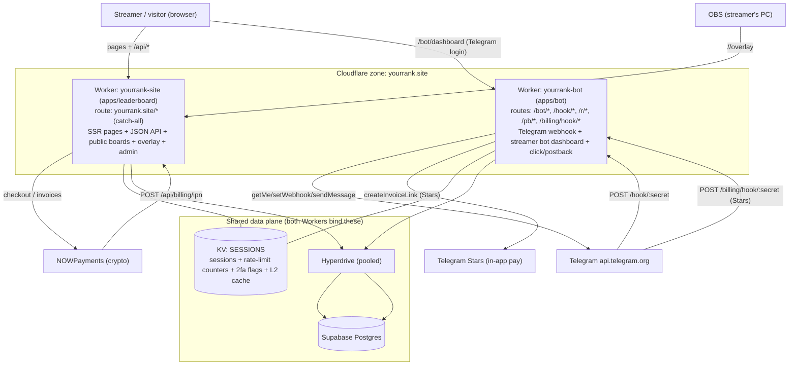
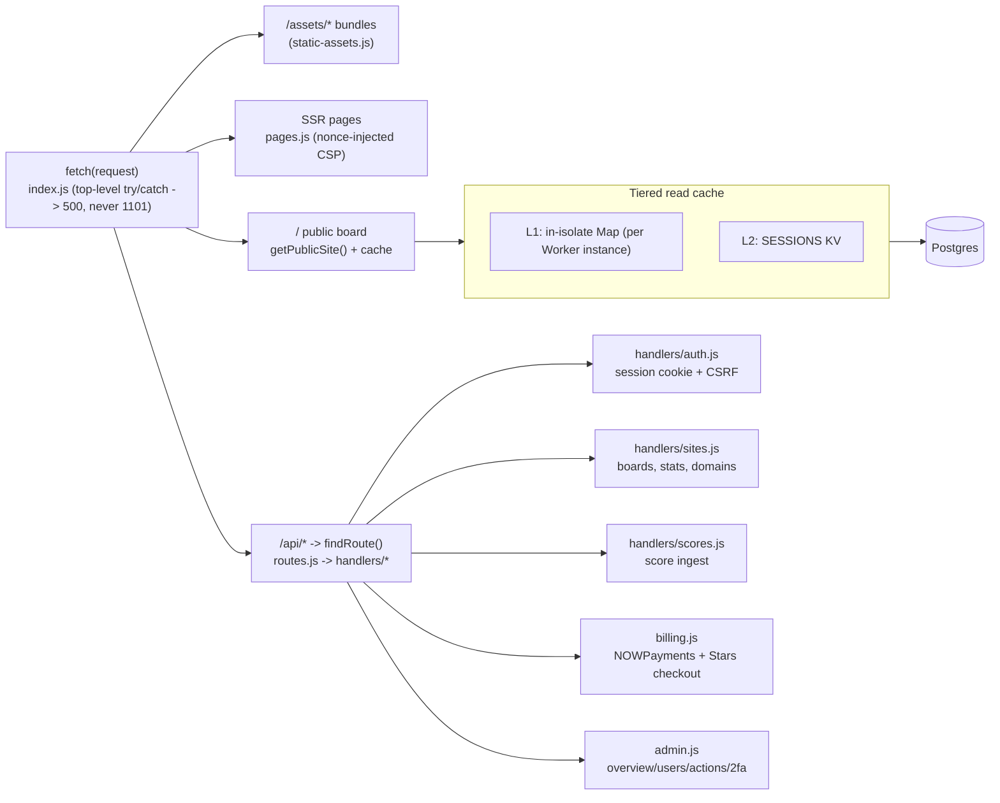
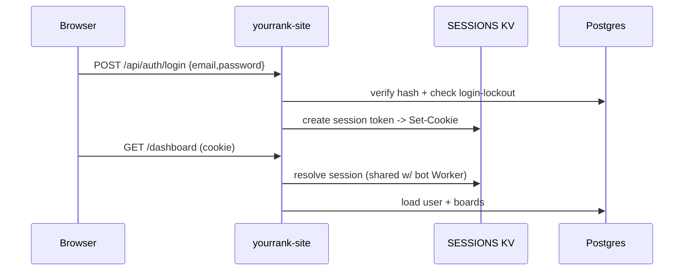
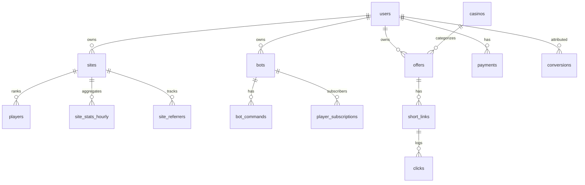

# YourRank — Full System Architecture & Connection Schema

A debugging map of the **entire platform**: how the two Cloudflare Workers, the
dashboard, the public leaderboard, auth/sessions, billing, analytics, the admin
panel, the OBS overlay, and the Telegram bot all connect. For the bot internals in
depth, see [`bot-architecture.md`](./bot-architecture.md).

---

## 1. System topology



**Three things to internalize:**
1. **One domain, two Workers.** Cloudflare routes the most-specific pattern first, so
   `yourrank-bot` owns `/bot/*`, `/hook/*`, `/r/*`, `/pb/*`, `/billing/hook/*`, and
   `yourrank-site` owns everything else (`yourrank.site/*`). Defined in each
   `apps/*/wrangler.toml`.
2. **Shared `SESSIONS` KV** = session cookies (readable by both Workers so login is
   unified), rate-limit counters (`ratelimit:*`), 2FA flags (`2fa:*`), and the L2
   public-board cache.
3. **One Postgres** (Supabase) reached by both Workers via Hyperdrive connection
   pooling.

---

## 2. Request routing map

| URL pattern | Worker | What it is |
|---|---|---|
| `/`, `/login`, `/signup`, `/forgot`, `/reset`, `/terms`, `/privacy`, `/responsible` | site | Static/SSR pages |
| `/dashboard`, `/dashboard/setup`, `/dashboard/analytics`, `/dashboard/billing`, `/dashboard/bot/setup` | site | Streamer dashboard (email+password auth) |
| `/admin` | site | Admin panel (admin flag + optional 2FA) |
| `/<slug>` | site | Public leaderboard (SSR) |
| `/<slug>/overlay` | site | OBS overlay (Pro; free = upsell) |
| `/go/<slug>` | site | CTA redirect + click stat bump |
| `/demo` | site | Hardcoded demo board (no DB) |
| `/api/auth/*` | site | signup / login / me / logout / forgot / reset |
| `/api/site*`, `/api/scores`, `/api/public/:slug/*` | site | Board CRUD, score ingest, public read APIs |
| `/api/billing/*` (`checkout`, `checkout-lifetime`, `trial`, `ipn`) | site | Crypto billing (NOWPayments) |
| `/api/admin/*` | site | Admin data + actions + 2FA |
| `/api/bot/connect` | site | Re-point an existing bot's webhook |
| `/bot/dashboard`, `/bot/dash/api/*`, `/bot/auth/*` | bot | Streamer **bot** dashboard (Telegram login) |
| `/hook/:secret` | bot | **All** Telegram bot updates (one endpoint, keyed by secret) |
| `/r/:slug` | bot | Tracked click redirect |
| `/pb`, `/pb/:key` | bot | Casino postbacks (signed / legacy) |
| `/billing/hook/:secret` | bot | Telegram Stars payment webhook |
| `/api/*` and `/bot/api/*` (bot) | bot | Admin API (x-api-key): provision users/bots/offers |

---

## 3. Main site (yourrank-site) internals



- **Public leaderboard render** (`/<slug>`): `getPublicSite()` reads L1 (isolate Map)
  → L2 (KV) → Postgres, then SSR's the board. Unpublished slug → "Coming Soon";
  unknown/reserved → 404. `/demo` uses hardcoded data (no DB).
- **Scores**: streamers push player standings via `POST /api/scores`; players ranked
  by `wagered`. "Close out" archives current standings and resets.
- **Multi-board**: one user can own several boards (`/api/site/list|create|archive`);
  each has a unique `slug`.
- **Overlay**: `/<slug>/overlay` is a Pro feature (FLIP-animated rankings for OBS);
  free plans get an upsell card.
- **CSP**: pages inject a per-request `nonce`; inline styles/scripts are nonce-tagged.

---

## 4. Auth, sessions & security



- **Sessions in KV**, not Postgres — shared namespace means the bot Worker trusts the
  same cookie. Tokens rotate ~24h.
- **CSRF**: state-changing `/api/*` require an `x-csrf-token` matching the cookie;
  auth bootstrap routes (signup/login/forgot/reset) are CSRF-exempt.
- **Login lockout** (per-account) throttles brute force independently of the KV rate
  limiter.
- **Admin 2FA**: TOTP enable/verify/disable under `/api/admin/2fa/*`.
- **Passwords** hashed (WebCrypto); **bot tokens** and **postback keys** stored
  encrypted at rest.

---

## 5. Billing

Two independent rails:
- **Crypto (NOWPayments)** on the site Worker: `POST /api/billing/checkout` /
  `checkout-lifetime` create an invoice; NOWPayments calls back `POST /api/billing/ipn`
  (idempotent by tx ref) to activate the plan. `POST /api/billing/trial` starts a trial.
- **Telegram Stars** on the bot Worker: the bot dashboard's Upgrade buttons call
  `createInvoiceLink`; Telegram posts payment updates to `POST /billing/hook/:secret`
  (`billing.ts`).
- **Effective plan** (Free / Starter / Pro / Agency) is computed from `payments` +
  expiry; a nightly cron downgrades expired plans (and can alert a Discord webhook).

---

## 6. Streamer dashboards — there are TWO

| | Main-site dashboard | Bot dashboard |
|---|---|---|
| URL | `/dashboard` (+ `/analytics`, `/billing`, `/bot/setup`, `/setup`) | `/bot/dashboard` |
| Worker | yourrank-site | yourrank-bot |
| Login | email + password | Telegram login widget `@arobasmohabot` (dev-login off in prod) |
| Purpose | Boards, scores, analytics, custom domain, crypto billing, **re-point** bot webhook | Connect/create bot, offers, tracked links, broadcasts, conversions, Stars billing, **bot customization** |

> This split is the usual source of "I can't add my bot" confusion: creating a bot row
> happens on the **bot** dashboard (or admin API). The main-site `/dashboard/bot/setup`
> only re-points the webhook of a bot that already exists.

---

## 7. Telegram bot (summary — full detail in bot-architecture.md)

- **Connect (create):** `/bot/dashboard` → `POST /bot/dash/api/bots` → `getMe` validate →
  encrypt token → `INSERT bots` → `setWebhook` to `/hook/:secret`.
- **Webhook:** one `POST /hook/:secret` endpoint serves all bots; the `:secret` (also the
  `X-Telegram-Bot-Api-Secret-Token` header) maps to a `bots` row. Engine handles
  `/start` (welcome), `/code` (offers), `/subscribe`, and custom commands.
- **Customization (PR #32):** welcome message (`bots.welcome_message`) + custom commands
  (`bot_commands`) editable from a dashboard panel; effective on the next update.
- **Tracking:** `/r/:slug` logs `clicks` then redirects; `/pb`+`/pb/:key` record
  `conversions`.

---

## 8. Data model (grouped)



| Group | Tables |
|---|---|
| Identity / plan | `users` (auth, `postback_key`, plan, admin/2fa), `payments`, `admin_audit`, `leads` |
| Boards | `sites` (slug, published, custom domain, brand/CTA), `players` (wagered), analytics: `site_stats_hourly`, `site_referrers` |
| Bot | `bots` (encrypted token, `webhook_secret`, `welcome_message`), `bot_commands`, `player_subscriptions` |
| Offers / tracking | `casinos`, `offers`, `short_links`, `clicks`, `conversions` |
| Sessions / cache | **KV** `SESSIONS` (not Postgres) |

---

## 9. Rate limiting & failure modes

- **`shared/ratelimit.ts`** — KV fixed-window counter used by both Workers
  (`admin:<ip>`, `redirect:<ip>`, `pb:<key>`, dashboard/auth…). One `get` + `put` per
  request, all in `SESSIONS`.
- **Free-tier KV ≈ 1,000 writes/day.** When exhausted, `put` throws until 00:00 UTC.
- **Fail-open (PR #32):** KV errors now ALLOW the request instead of denying it. Before,
  it failed CLOSED, so a spent write quota 429'd *every* endpoint platform-wide
  ("rate limited forever"). Real over-limit is still denied.
- **1101 guards (PR #32):** site top-level `fetch` and the bot Worker's Toucan/Sentry
  init are wrapped so an uncaught throw returns 500 instead of a Cloudflare **1101**
  page.

> Permanent fix is infra: raise the KV write limit (Cloudflare Workers Paid plan) on the
> account owning the `SESSIONS` namespace. Code only degrades gracefully during exhaustion.

---

## 10. Deploy & CI

- **PR checks:** Lint, Typecheck, Test, Build, Dependency Audit, CodeQL (+ sbom).
- **Deploy** on push to `main`: `deploy-site` and `deploy-bot` publish each Worker via
  Wrangler. (A bot typecheck failure previously aborted `deploy-bot` so the bot Worker
  stopped shipping — fixed in PR #30.)
- **Migrations:** `supabase/migrations/*` (schema), `supabase/seed.sql` (sample data).

---

## 11. "Where do I look?" index

| Symptom | File / route |
|---|---|
| Everything 429s / "rate limited forever" | `shared/ratelimit.ts` (KV write quota) |
| Cloudflare 1101 on refresh | `apps/leaderboard/src/index.js` top-level fetch; `apps/bot/src/worker.ts` Toucan init |
| Login/session issues | `apps/leaderboard/src/handlers/auth.js` + `SESSIONS` KV |
| Dashboard "Save changes" fails | `handlers/sites.js` `handlePutSite` (see PR #31 endsAt fix) |
| Public board wrong/stale | `getPublicSite()` L1/L2 cache → Postgres |
| Scores not updating | `handlers/scores.js` `POST /api/scores` |
| Crypto payment not activating | `billing.js` `handleIpn` (idempotency) |
| Stars payment not activating | `apps/bot/src/billing.ts` `POST /billing/hook/:secret` |
| Admin panel access | `admin.js` (admin flag + 2FA) |
| Overlay blank/upsell | `index.js` `/<slug>/overlay` (Pro gate) |
| Can't add / customize bot | see [`bot-architecture.md`](./bot-architecture.md) |
| Routing between Workers | `apps/*/wrangler.toml` `routes` |
```
