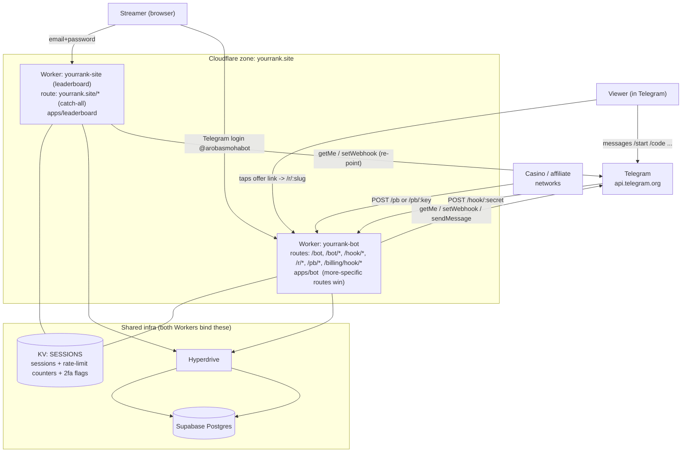
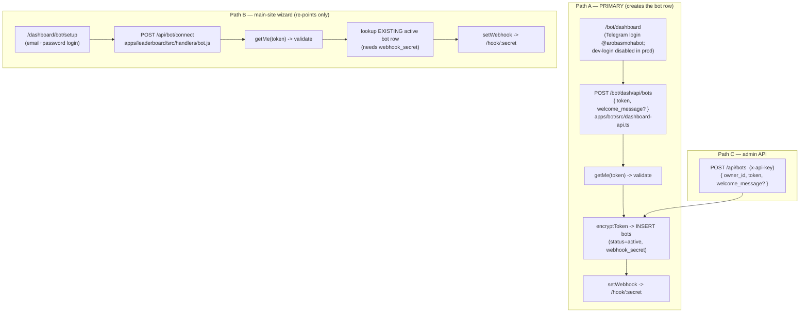
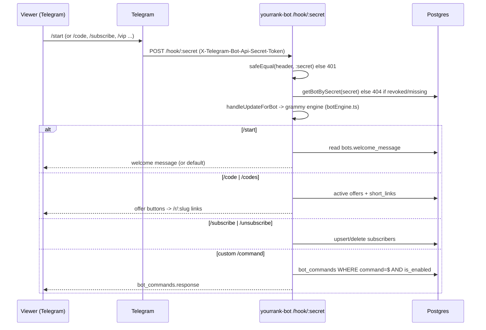
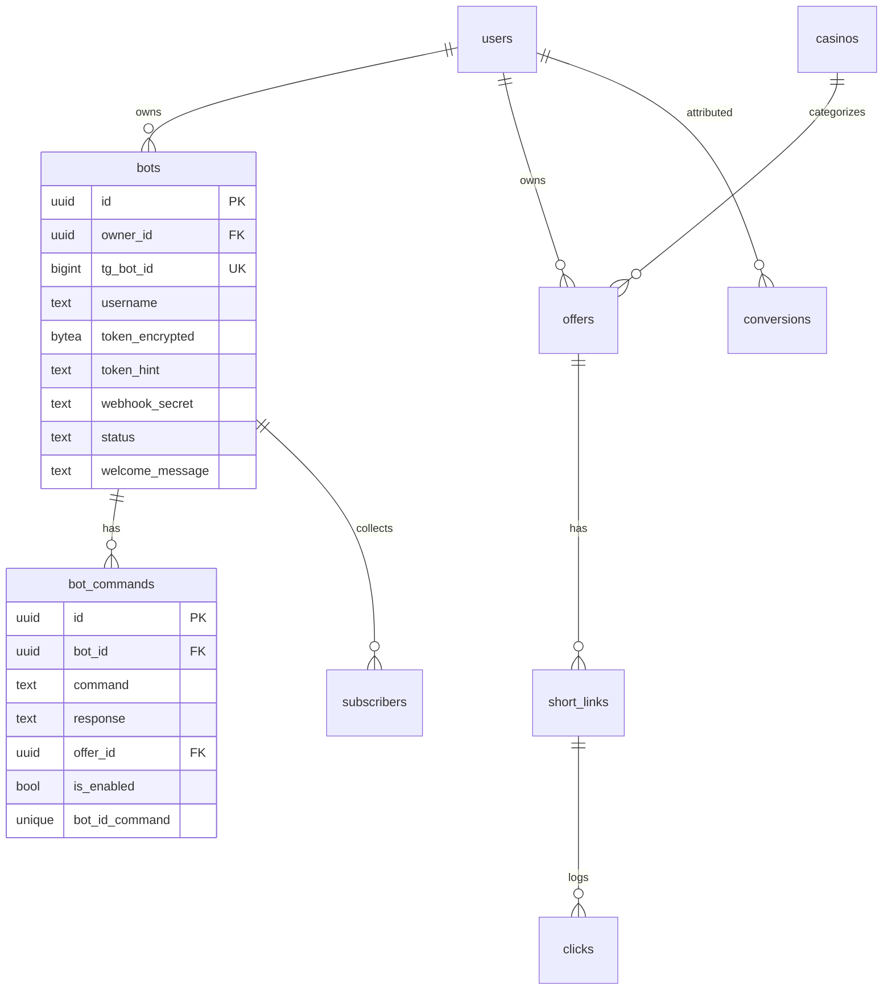

# YourRank — Telegram Bot System: Connection Schema

A debugging map of how every piece of the Telegram bot flow connects: Cloudflare
routing, the two Workers, the connect paths, the webhook, the database tables,
and shared KV. Use this to trace "where does X happen" fast.

---

## 1. High-level topology



Key facts:
- **Two Workers, one domain.** `yourrank-site` owns `yourrank.site/*`. `yourrank-bot`
  owns the more-specific `/bot/*`, `/hook/*`, `/r/*`, `/pb/*`, `/billing/hook/*`
  (Cloudflare picks the most specific matching route). See each `wrangler.toml`.
- **Shared session store.** Both Workers bind the **same** `SESSIONS` KV namespace,
  so a login cookie set by one Worker is readable by the other. That same namespace
  ALSO holds rate-limit counters (`ratelimit:*`) and 2FA flags (`2fa:*`).
- **One DB.** Both Workers reach the same Supabase Postgres through Hyperdrive.

---

## 2. Adding a bot — there are 3 entry points



Gotcha worth knowing while debugging:
- **Path B cannot create a bot by itself.** `handleBotConnect` looks up an existing
  `status='active'` bot row and errors with *"No bot record found. Please complete
  bot setup from the dashboard first."* if there isn't one. Only **Path A** (or the
  admin API) inserts into `bots`. Path B just re-points the webhook for a bot that
  already exists.
- The token is validated against Telegram (`getMe`) in every path, so a fake/malformed
  token fails fast — a well-formed but non-real token returns *"Telegram says this
  token is invalid."*
- Tokens are stored **encrypted** (`bots.token_encrypted`, `TOKEN_ENC_KEY`); only the
  last 4 chars are kept in clear as `token_hint`.

---

## 3. Runtime message flow (viewer <-> bot)



- **One webhook endpoint serves ALL bots.** `/hook/:secret` disambiguates by the
  secret (`bots.webhook_secret`), which is also the Telegram
  `X-Telegram-Bot-Api-Secret-Token` header — both must match.
- Built-in commands (`start`, `code`, `codes`, `subscribe`, `unsubscribe`) are handled
  by the engine directly; the catch-all `message::bot_command` handler serves
  **custom** commands from `bot_commands` and deliberately skips the built-ins.

---

## 4. Click tracking & conversions

- `GET /r/:slug` — looks up `short_links -> offers`, logs a row in `clicks`
  (via `waitUntil`), then 302-redirects to the offer `referral_url` with
  `{click_ref}` / `{click_id}` substituted. Rate-limited `redirect:<ip>` 200/60s.
- `POST /pb` (signed, preferred) or `GET|POST /pb/:key` (legacy, unsigned) —
  resolves the owner by `users.postback_key`, then `recordConversion` writes to
  `conversions`. Signed path verifies HMAC-SHA256 of the query string.

---

## 5. Customization surface (welcome message + custom commands)

Managed from the **"Customize your bot"** panel on `/bot/dashboard`, backed by these
`/bot/dash/api` endpoints (owner-scoped; PR #32):

| Method & path | Table | Purpose |
|---|---|---|
| `PATCH /bots/:id` | `bots.welcome_message` | Edit the `/start` reply |
| `GET /bots/:id/commands` | `bot_commands` | List custom commands |
| `POST /bots/:id/commands` | `bot_commands` | Upsert on `(bot_id, command)` |
| `PATCH /commands/:id` | `bot_commands` | Toggle `is_enabled` / edit `response` |
| `DELETE /commands/:id` | `bot_commands` | Remove a command |

Command names are normalized (strip leading `/`, lowercase, `^[a-z0-9_]{1,32}$`)
exactly as the engine derives them, and built-in names are rejected (a custom row by
that name would never fire). Changes take effect on the next Telegram update — no
redeploy.

---

## 6. Database tables in the bot flow



- `bots` — one row per connected Telegram bot. `webhook_secret` links Telegram's
  `/hook/:secret` back to the row; `tg_bot_id` is the unique key for upserts.
- `bot_commands` — custom commands, unique on `(bot_id, command)`; FKs cascade on
  `bots` and `offers` delete.
- `offers`/`casinos`/`short_links` — the `/code` offer list and `/r/:slug` links.
- `clicks`/`conversions` — tracking + postback attribution.
- `subscribers` — `/subscribe` audience for broadcasts.

---

## 7. Rate limiting & failure modes (the recent outage)

- **`shared/ratelimit.ts`** — a KV fixed-window counter used by BOTH Workers
  (`admin:<ip>`, `redirect:<ip>`, `pb:<key>`, dashboard/auth, etc.). It does a KV
  `get` + `put` on every request, all in the shared `SESSIONS` namespace.
- **Free-tier KV = ~1,000 writes/day.** Once exhausted, `put` throws for the rest of
  the UTC day (resets 00:00). Reads (~100k/day) keep working.
- **Fail-open (PR #32).** The limiter now ALLOWS a request when KV errors (missing
  binding / read fail / write fail) instead of denying it. Before, it failed CLOSED,
  so a spent write quota 429'd *every* endpoint platform-wide ("rate limited forever").
  A request already allowed by the read is never flipped to denied by a failed write.
- **1101 guards (PR #32).** The leaderboard top-level `fetch` and the bot Worker's
  Toucan (Sentry) init are wrapped so an uncaught throw returns a 500 instead of a
  Cloudflare **1101 "Worker threw exception"** page.

> Permanent fix is infra, not code: raise the KV write limit (Cloudflare Workers Paid
> plan) on the account owning the `SESSIONS` namespace. The code fix only keeps the
> site up while the quota is exhausted (rate limiting is effectively off during that
> window).

---

## 8. Quick "where do I look?" index

| Symptom | File / route |
|---|---|
| Can't log into bot dashboard | Telegram widget `@arobasmohabot`; dev-login disabled in prod (`/bot/auth/dev` -> 403) |
| Connect bot (create) | `apps/bot/src/dashboard-api.ts` `POST /bots` |
| Connect bot (re-point) | `apps/leaderboard/src/handlers/bot.js` `POST /api/bot/connect` |
| Incoming Telegram messages | `apps/bot/src/hono-app.ts` `POST /hook/:secret` -> `botEngine.ts` |
| Custom commands / welcome msg | `dashboard-api.ts` (API) + `dashboard-views.ts` (UI) + `botEngine.ts` (runtime) |
| Click redirect | `hono-app.ts` `GET /r/:slug` |
| Postbacks/conversions | `hono-app.ts` `POST /pb`, `GET|POST /pb/:key` -> `conversions.ts` |
| Rate limiting | `shared/ratelimit.ts` (KV `SESSIONS`) |
| Routing between Workers | `apps/*/wrangler.toml` `routes` |
```
